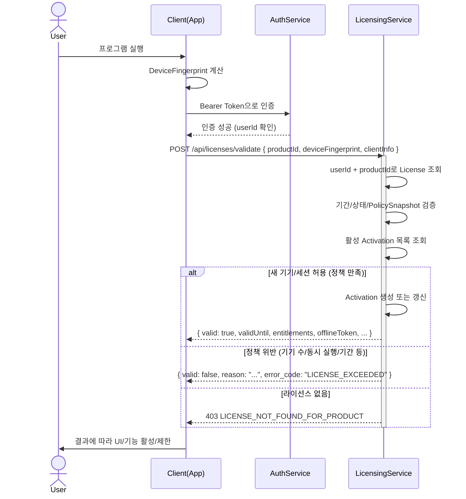

# Licensing 도메인 설계 v1.1

본 문서는 상용 소프트웨어(예: 화재 시뮬레이션 관련 도구)의 **라이선싱 도메인 설계**를 정의한다.

## 변경 이력

| 버전 | 날짜 | 변경 내용 |
|-----|------|----------|
| v1.0 | 2025-12-08 | 최초 작성 |
| v1.1 | 2025-12-17 | 계정 기반 API 지원을 위한 도메인 메서드 추가 (IsOwnedBy) |

> **Note:** Claim 기능(ClaimToUser, IsUnclaimed)은 제외되었습니다. 추후 Redeem 기능으로 별도 구현 예정입니다.

---  
초기 릴리스에서는 **개인 라이선스 + 기본 Billing 연동**만 구현하며,  
향후 **조직/교육기관(Organization) 라이선스**로 확장 가능한 형태를 목표로 한다.

---

## 1. 목적 및 범위

### 1.1 목적

- 결제 완료 시 **라이선스 발급**.
- 사용자가 **여러 기기(집/회사/노트북)를 편하게 오가며 사용**할 수 있는 라이선스 모델 제공.
- 단순 Key/Seat 모델보다 진보된 **계정 기반 + 기기 슬롯 + 동시 실행 + 오프라인 유예** 모델 구현.
- 향후 **조직/교육기관(Org)용 라이선스** 추가를 고려한 도메인/스키마 설계.

### 1.2 범위 (v1)

- 포함:
  - 개인 사용자(User) 기준 라이선스 발급/검증/활성화.
  - Billing/Payment와 연동된 라이선스 발급 (OrderPaid → License Issue).
  - 기기 단위 활성화(Activation), 동시 실행/오프라인 유예 등 정책 적용.
- 제외 (향후 확장):
  - Organization / OrgMember / OrgLicensePool / Course/ClassGroup / LicenseAssignment 등 단체/교육 기능.
  - 복잡한 리포팅/감사(Audit) 기능.

---

## 2. Bounded Context 및 외부 연동 관계

### 2.1 Licensing Bounded Context

**Licensing BC의 책임**

- 라이선스 라이프사이클 관리:
  - 발급(Issue), 활성화(Activate), 검증(Validate), 만료(Expire), 정지/회수(Suspend/Revoke).
- 정책 및 제약:
  - 라이선스 종류(Trial/Perpetual/Subscription).
  - 기기 수 제한(`MaxActivations`), 동시 실행 제한(`MaxConcurrentSessions`).
  - 오프라인 허용 기간(`AllowOfflineDays`).
  - Entitlement(사용 가능 기능/모듈 목록).
- Activation/Device 기반 사용 현황 관리.

**Licensing이 참조하는 외부 BC**

- **Auth/Account BC**
  - `UserId`, `Email`, `TenantId` 등 사용자 식별자.
- **Billing/Payment BC**
  - `OrderId`, `UserId`, `ProductId`, 결제 상태 등.
  - Licensing은 `OrderPaid` / `OrderRefunded` 이벤트(또는 API 호출)를 입력으로 사용한다.

---

## 3. 도메인 모델

### 3.1 Aggregate: License

**의미**  
특정 Owner(개인/조직)가 특정 Product/Plan을 특정 정책 하에 사용할 수 있는 **사용 권리**.

**필드 (예시)**

- 식별/소유
  - `LicenseId` : UUID
  - `OwnerType` : `'user'` (v1), 향후 `'org'` 추가 예정
  - `OwnerId` : `UserId` (v1에서는 `users.id`)
- 대상 제품/플랜
  - `ProductId`
  - `PlanId` / `Edition` (예: Standard/Pro 등)
- 타입/정책
  - `LicenseType` : `Perpetual | Subscription | Trial | OfflineOnly ...`
  - `PolicySnapshot` : JSON 또는 Embeddable
    - `MaxActivations`
    - `MaxConcurrentSessions`
    - `AllowOfflineDays`
    - `Entitlement` (기능/모듈 세트)
- 기간/상태
  - `IssuedAt`
  - `ValidFrom`
  - `ValidUntil` (Perpetual일 경우 null/Max)
  - `Status` : `Pending | Active | Expired | Suspended | Revoked`
- 기타
  - `SourceOrderId` : Billing의 주문 ID 참조
  - 메모/태그 등 (선택)

**주요 도메인 메서드(개념)**

- `Issue(...)`  
  - 주문 정보 + 정책 기반으로 `License` 생성.
- `Activate(deviceFingerprint, clientInfo, now)`  
  - 정책, 기기 슬롯, 동시 실행 제한을 고려하여 Activation 생성/갱신.
- `Deactivate(activationId or deviceFingerprint, now)`  
  - 특정 기기/세션 비활성화.
- `CanActivate(deviceFingerprint, now)`  
  - 새로운 활성화 허용 여부 판단.
- `Validate(deviceFingerprint, now)`  
  - 기간/상태/정책/Activation을 종합하여 유효성 판단.
- `Suspend(reason)`, `Revoke(reason)`
  - 라이선스 정지/회수.
- `Renew(newValidUntil)`
  - 구독 연장 등.
- `IsOwnedBy(userId)` *(v1.1 추가)*
  - 해당 라이선스가 특정 사용자 소유인지 확인.
  - `OwnerType == 'user' && OwnerId == userId`일 때 true.

---

### 3.2 Entity: Activation

**의미**
특정 라이선스를 **특정 기기 환경**에서 사용 중인 "활성화 인스턴스".

**필드 (예시)**

- `ActivationId` : UUID
- `LicenseId` : FK to `licenses.id`
- `DeviceFingerprint` : 기기 식별 해시
- `ActivatedAt`
- `LastSeenAt` : 마지막 검증/heartbeat 시각
- `Status` : `Active | Stale | Deactivated | Expired`
- `OfflineToken` : 오프라인 사용을 위한 서명된 토큰 (선택)
- `OfflineTokenExpiresAt` : 오프라인 토큰 만료 시각
- `ClientInfo` (선택)
  - 클라이언트 버전
  - OS/플랫폼
  - IP/Region 등

**역할**

- `MaxActivations`, `MaxConcurrentSessions`, `AllowOfflineDays`와 함께:
  - 기기 슬롯/동시 실행/오프라인 유예 정책을 구체적으로 구현하는 단위.

#### Activation 상태 정의

| 상태 | 설명 | 전이 조건 |
|------|------|-----------|
| `ACTIVE` | 정상 사용 중. 최근 N시간/일 이내에 Validate/Heartbeat 성공 | 초기 활성화 시 또는 STALE에서 재접속 시 |
| `STALE` | 계약은 유효하지만, `LastSeenAt`이 `stalePeriodDays`(TBD, 예: 30일) 이상 경과 | ACTIVE 상태에서 장기간 미접속 |
| `DEACTIVATED` | 사용자 또는 관리자가 명시적으로 비활성화 | 수동 해제 요청 시 |
| `EXPIRED` | 라이선스 계약 자체가 만료됨 (Grace Period 포함) | 라이선스 만료 시 일괄 전이 |

#### Activation 상태 전이 규칙

```
[신규 활성화] ──→ ACTIVE
                    │
                    ├──(LastSeenAt 기준 N일 경과)──→ STALE
                    │                                  │
                    │                                  ├──(재접속 성공)──→ ACTIVE
                    │                                  │
                    │                                  └──(라이선스 만료)──→ EXPIRED
                    │
                    ├──(수동 해제 요청)──→ DEACTIVATED
                    │
                    └──(라이선스 만료)──→ EXPIRED
```

**STALE vs EXPIRED 차이점**

- **STALE**: 결제/계약은 유효하나 장기간 미접속. 재접속 시 ACTIVE로 복귀 가능. 주로 "활성 사용자 수 측정", "라이선스 사용률 리포팅"에 활용.
- **EXPIRED**: 계약 종료 상태. 재접속 시도 시 `LICENSE_EXPIRED` 오류 반환. 갱신/재구매 필요.

---

### 3.3 만료 및 Grace Period 정책

구독(Subscription) 라이선스의 만료 처리 시, 즉시 차단이 아닌 **Grace Period(유예 기간)**를 제공하여 UX를 개선하고 CS 문의를 줄인다.

#### License 만료 상태 정의

| 상태 | 조건 | 앱 동작 |
|------|------|---------|
| `ACTIVE` | `now < validUntil` | 정상 사용 |
| `EXPIRED_GRACE` | `validUntil ≤ now < validUntil + gracePeriodDays` | 경고 메시지 표시, 기능은 전체(또는 일부) 허용 |
| `EXPIRED_HARD` | `now ≥ validUntil + gracePeriodDays` | 로그인/활성화 차단, 갱신 필요 안내 |

#### 정책 파라미터

```json
{
  "gracePeriodDays": 7,           // TBD: 7일 또는 14일
  "gracePeriodFeatures": "full",  // "full" | "limited" | "readonly"
  "showExpirationWarningDays": 14 // 만료 N일 전부터 경고 배너 표시
}
```

#### Grace Period 동작 상세

1. **만료 경고 단계** (`validUntil - showExpirationWarningDays` ~ `validUntil`)
   - 앱 내 "N일 후 만료 예정" 배너 표시
   - 모든 기능 정상 사용 가능

2. **유예 기간** (`validUntil` ~ `validUntil + gracePeriodDays`)
   - 상태: `EXPIRED_GRACE`
   - 앱 동작:
     - `gracePeriodFeatures = "full"`: 모든 기능 사용 가능 + 강조된 갱신 안내
     - `gracePeriodFeatures = "limited"`: 출력/저장/내보내기 등 일부 기능 제한
     - `gracePeriodFeatures = "readonly"`: 읽기 전용 모드

3. **완전 만료** (`validUntil + gracePeriodDays` 이후)
   - 상태: `EXPIRED_HARD`
   - 새로운 활성화 차단
   - 기존 Activation도 `EXPIRED` 상태로 전이
   - Validate 요청 시 `LICENSE_EXPIRED` 오류 코드 반환

#### v1 기본값 (TBD)

- `gracePeriodDays`: 7일
- `gracePeriodFeatures`: "full"
- `showExpirationWarningDays`: 14일

---

### 3.4 PolicySnapshot / Entitlement

**PolicySnapshot 예시 스키마**

```json
{
  "maxActivations": 3,
  "maxConcurrentSessions": 2,
  "licenseDurationDays": 365,
  "allowOfflineDays": 7,
  "entitlements": [
    "core-simulation",
    "advanced-visualization",
    "export-csv"
  ]
}
발급 시점의 Policy를 그대로 License에 저장하여,

이후 정책 변경이 기존 라이선스에 영향을 주지 않게 한다.

3.5 Value Objects
LicenseKey

외부 노출용 시리얼 문자열:

예: XXXX-XXXX-XXXX-XXXX

내부적으로는 랜덤 값 + 서명/검증 로직 포함.

DeviceFingerprint

HW ID, OS, 랜덤 Client ID 등을 조합해 해시한 값.

동등성/비교 (Equals, IsSameMachineAs) 로직 포함.

Entitlement

사용 가능한 기능/모듈/애드온 ID 리스트.

클라이언트에서 UI/기능 On/Off에 사용.

4. 데이터 모델 (ERD)
아래 ERD는 v1 기준이며, 향후 Organization/OrgLicensePool/Assignment 등의 테이블이 추가될 수 있다.
OwnerType/OwnerId를 통해 개인/조직 소유자 모두를 수용할 수 있도록 설계한다.

mermaid
코드 복사
erDiagram
    USER {
        uuid id
        string email
        string name
    }

    PRODUCT {
        uuid id
        string name
        string code
    }

    ORDER {
        uuid id
        uuid user_id
        uuid product_id
        string status
        datetime paid_at
    }

    LICENSE {
        uuid id
        string owner_type      // 'user' (v1), 향후 'org'
        uuid owner_id          // users.id (v1), 향후 orgs.id
        uuid product_id
        uuid source_order_id
        string license_type    // 'trial', 'perpetual', 'subscription', ...
        string status          // 'pending', 'active', 'expired', ...
        datetime issued_at
        datetime valid_from
        datetime valid_until
        json policy_snapshot   // PolicySnapshot
        string license_key     // 외부 노출용 시리얼
    }

    LICENSE_ACTIVATION {
        uuid id
        uuid license_id
        string device_fingerprint
        string status          // 'active', 'deactivated', 'stale', ...
        datetime activated_at
        datetime last_seen_at
        string client_version
        string client_os
        string last_ip
    }

    USER ||--o{ ORDER : "places"
    PRODUCT ||--o{ ORDER : "is ordered in"
    ORDER ||--o{ LICENSE : "creates"
    LICENSE ||--o{ LICENSE_ACTIVATION : "has"
참고:

USER, PRODUCT, ORDER는 외부 BC(Auth, Billing)에서 관리하되,
Licensing 입장에서는 FK/ID 형태로만 참조한다.

v2 이후 Organization 도입 시 LICENSE.owner_type='org', owner_id=orgs.id가 추가될 예정이다.

5. 주요 유스케이스 및 시퀀스 다이어그램
5.1 결제 완료 → 라이선스 발급 (OrderPaid → License Issue)
설명

사용자가 Product를 결제하면 Billing BC에서 OrderPaid 이벤트(or API 호출)가 발생한다.

Licensing BC는 이 정보를 기반으로 License를 발급하고 LicenseKey를 생성한다.

mermaid
코드 복사
sequenceDiagram
    actor U as User
    participant B as BillingService
    participant L as LicensingService

    U->>B: 결제 요청 (상품/플랜)
    B-->>U: 결제 완료 응답

    B->>L: OrderPaid(orderId, userId, productId, planId, paidAt)
    activate L

    L->>L: 정책 조회 및 PolicySnapshot 생성
    L->>L: License.Issue(ownerType='user', ownerId=userId, productId, policySnapshot, sourceOrderId)

    L-->>B: LicenseIssued(licenseId, licenseKey, userId, productId)
    deactivate L

    B-->>U: 라이선스 정보 전달 (이메일/웹 UI 등)
### 5.2 클라이언트 실행 → 라이선스 검증 및 활성화 (Validate/Activate)

#### 설명

사용자가 프로그램을 실행하면, 클라이언트는 서버에 라이선스 검증을 요청한다.

서버는 License와 Activations를 확인 후:
- 새 Activation 생성 또는 기존 갱신.
- 정책 위반 시 오류 응답.

#### v1.1 변경사항

v1.1부터 계정 기반 API가 권장된다:
- 클라이언트는 **Bearer Token**으로 인증
- 요청에 **licenseKey 대신 productId**만 포함
- 서버가 **userId + productId**로 라이선스 자동 조회

#### 시퀀스 다이어그램 (v1.1 계정 기반)



#### 추가 고려사항

- offlineToken에 AllowOfflineDays까지 유효한 서명된 토큰 포함 가능.
- 클라이언트는 주기적으로 heartbeat를 보내 LastSeenAt 갱신.

5.3 환불/취소 → 라이선스 회수 (OrderRefunded → Revoke)
설명

결제가 환불되면 Billing BC가 OrderRefunded 이벤트를 발행한다.

Licensing BC는 해당 주문에 연결된 라이선스를 찾아 Revoke 처리한다.

mermaid
코드 복사
sequenceDiagram
    participant B as BillingService
    participant L as LicensingService

    B->>L: OrderRefunded(orderId, userId, productId)
    activate L

    L->>L: source_order_id = orderId 인 License 조회
    L->>L: License.Revoke(reason="refunded")
    L->>L: 관련 Activation 모두 Status 변경(Deactivated)

    L-->>B: LicenseRevoked(licenseId, orderId)
    deactivate L

---

### 5.4 동시성 처리 (MaxConcurrentSessions)

`MaxConcurrentSessions` 정책 검증 시 race condition을 방지하기 위한 전략을 정의한다.

#### 문제 상황

```
MaxConcurrentSessions = 2인 상태에서:
- 클라이언트 A, B가 동시에 Activate 요청
- 둘 다 "현재 active 세션 = 1" 로 조회
- 둘 다 통과 → 실제로는 3개 활성화 (정책 위반)
```

#### 해결 전략

**v1 구현: DB 트랜잭션 + Row-level Locking**

```sql
-- Activate 요청 처리 시
BEGIN;

-- 해당 라이선스에 대해 배타적 락 획득
SELECT * FROM licenses WHERE id = :licenseId FOR UPDATE;

-- 현재 활성 세션 수 조회
SELECT COUNT(*) FROM license_activations
WHERE license_id = :licenseId AND status = 'ACTIVE';

-- 정책 확인 후 INSERT/UPDATE
IF count < maxConcurrentSessions THEN
  INSERT INTO license_activations (...) ...;
END IF;

COMMIT;
```

**대안 (고부하 환경)**

- Redis 분산 락: `license:{id}:lock` 키로 짧은 TTL 락 사용
- Unique Index + Active Flag: `(license_id, device_fingerprint)` 조합에 unique index

#### 구현 원칙

- 단순 "SELECT COUNT(*) 후 INSERT" 패턴은 **허용하지 않음**
- 모든 Activate/Deactivate 작업은 트랜잭션 내에서 락과 함께 처리

---

### 5.5 Offline Token 보안

오프라인 환경에서도 라이선스 검증이 가능하도록 `offlineToken`을 발급하되, 탈취 리스크를 최소화한다.

#### 토큰 구조 및 바인딩

```json
{
  "licenseId": "uuid",
  "deviceId": "device-fingerprint-hash",
  "entitlements": ["core-simulation", "export-csv"],
  "issuedAt": "2024-01-15T10:00:00Z",
  "expiresAt": "2024-02-14T10:00:00Z",
  "signature": "..."
}
```

- 토큰은 특정 `deviceId`에 바인딩되어 발급
- 서버는 `(licenseId, deviceId, tokenHash)` 조합을 저장하여 추적

#### 토큰 유효기간

| 설정 | 기본값 (TBD) | 설명 |
|------|--------------|------|
| `offlineTokenValidDays` | 30일 | 토큰 발급 후 유효 기간 |
| `offlineTokenRenewThreshold` | 7일 | 남은 기간이 이 값 이하일 때 온라인 접속 시 자동 갱신 |

#### Revocation (무효화) 메커니즘

1. **관리자/서버에서 지원하는 기능**
   - 특정 `deviceId` 또는 `licenseId`에 대해 offlineToken 강제 무효화
   - 무효화된 토큰 목록을 `revoked_offline_tokens` 테이블에 기록

2. **클라이언트 동작**
   - 온라인 연결 시 서버에서 revocation 상태 확인
   - 토큰이 revoke된 경우 즉시 무효화, 재인증 필요

3. **토큰 탈취 의심 시 대응 프로세스**
   - 해당 라이선스/기기의 offlineToken revocation
   - 필요 시 라이선스 재발급 또는 deviceId 리셋
   - 감사 로그 기록

#### ValidateLicense API Rate Limiting

오프라인 토큰 남용 및 API 과부하 방지를 위한 정책:

**서버 측**
- 라이선스 키 단위: 분당 60회 제한 (429 Too Many Requests)
- IP 단위: 분당 300회 제한

**클라이언트 권장사항**
- 정상 응답은 최소 5분간 로컬 캐시
- 네트워크 오류 시 exponential backoff 재시도 (1s → 2s → 4s → ... 최대 60s)
- 오프라인 모드 진입 시 offlineToken 사용

---

## 6. 확장 포인트 (조직/교육기관 라이선스)
v1에서는 개인 라이선스만 구현하지만,
향후 아래와 같은 구조로 확장할 수 있도록 설계되어 있다.

6.1 Organization 관련 추후 추가 예정 엔티티
organizations

학교/연구실/팀 등.

org_members

OrgId, UserId, Role(Owner/Admin/Instructor/Student 등).

org_license_pools

OrgId, PlanId, TotalSeats, ConsumedSeats, ValidFrom, ValidUntil.

license_assignments

OrgId, UserId(또는 CourseId), LicenseId, AssignedAt, ReleasedAt.

(선택) courses / class_groups

OrgId, 이름, 담당자, SeatLimit, 기간 등.

6.2 라이선스 모델과의 관계
licenses.owner_type:

'user' → 개인 구매 라이선스 (v1)

'org' → 조직 소유 라이선스 (향후)

Org 라이선스는 Assignment를 통해 User에게 배정/회수:

Named User 패턴

Course(강의) 단위 관리

랩 PC Device 기반 라이선스 등

---

### 6.3 License Transfer (라이선스 이전)

라이선스를 다른 사용자 또는 기기로 이전하는 시나리오를 정의한다.

#### 지원 시나리오

| 시나리오 | 설명 | 예시 |
|----------|------|------|
| 기기 간 이전 | 동일 사용자가 A PC → B PC로 활성화 이동 | 컴퓨터 교체, 포맷 후 재설치 |
| 사용자 간 이전 | A 사용자 → B 사용자로 라이선스 소유권 이전 | 퇴사자 라이선스를 신규 직원에게 이관 |
| 조직 내 재배정 | Org 라이선스 풀에서 멤버 간 좌석 재배정 | 프로젝트 종료 후 다른 팀원에게 배정 |

#### v1 정책 (Out-of-scope)

v1에서는 **셀프 서비스 Transfer 기능을 구현하지 않는다**.

**v1 대응 방식:**
- 기기 간 이전: 사용자가 기존 기기에서 Deactivate 후 새 기기에서 Activate (기존 기능으로 해결)
- 사용자 간 이전: CS/관리자가 수동으로 처리
  1. 기존 라이선스 Revoke
  2. 신규 사용자에게 새 라이선스 발급
  3. 필요 시 잔여 기간 계산하여 적용

**v2 이후 고려사항:**
- Transfer API 제공 (`POST /licenses/{id}/transfer`)
- Transfer 이력 추적 (`license_transfer_logs` 테이블)
- Transfer 횟수/주기 제한 정책 (악용 방지)

---

## 7. 요약
본 문서는 Licensing 도메인의 v1 설계를 정의한다.

v1에서는:

개인(User) 기준 License/Activation/PolicySnapshot만 구현.

Billing의 OrderPaid/OrderRefunded를 통해 라이선스 발급/회수.

계정 기반 + 기기 슬롯 + 동시 실행 + 오프라인 유예를 지원할 수 있는 구조를 마련.

DB/도메인/시퀀스 설계는 향후 Organization/교육기관 기능 추가 시

테이블/컬럼 추가 및 제한적인 마이그레이션만으로 확장이 가능하도록 구성되어 있다.

